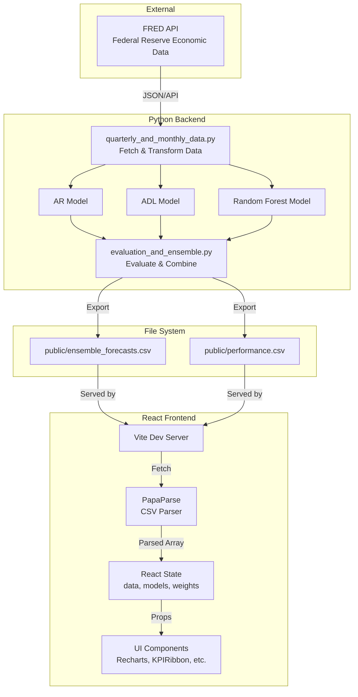

# Econbet - USA Macrocast Terminal

Econbet is a React-based dashboard for macroeconomic nowcasting. It visualizes real-time and historical GDP forecasts using various econometric and machine learning models (AR, ADL, Random Forest, and Ensemble).

## Table of Contents
1. [Features](#features)
2. [Tech Stack](#tech-stack)
3. [System Architecture](#system-architecture)
4. [Key Files and Folders](#key-files-and-folders)
5. [Technical Documentation](#technical-documentation)
6. [Setup & Installation](#setup--installation)
7. [Running Locally](#running-locally)

---

## Features
* **Interactive GDP Nowcasting:** Compare actual GDP data against model forecasts.
* **Ragged Edge Simulator:** Simulate the real-time flow of macroeconomic data releases throughout the month to see how data availability impacts model readiness.
* **Historical Scenario Analysis:** Explore how the models would have performed during major economic shocks (e.g., the 2008 Global Financial Crisis, 2020 COVID-19 Shock).
* **Custom Ensemble Weights:** Adjust the weighting of different models to create your own custom forecast.
* **Dark Mode:** Fully responsive and accessible dark/light mode UI.

## Tech Stack
* **Frontend:** React 18, TypeScript, Vite, Tailwind CSS, Recharts, PapaParse
* **Backend:** Python 3.10+, Pandas, Statsmodels, Scikit-Learn, FredAPI

---

## System Architecture

Here is a flow diagram showing how the Python backend integrates with the React frontend:



---

## Key Files and Folders

The repository is organized into a decoupled architecture, separating the Python data science pipeline from the React frontend.

* **`backend/`**: Contains the Python data pipeline and econometric models.
  * `quarterly_and_monthly_data.py`: Connects to the FRED API, fetches raw macroeconomic data, and applies stationarity transformations.
  * `models/`: Contains the individual model implementations (`ar_model.py`, `adl_model.py`, `random_forest_model.py`).
  * `run_ensemble.py`: The main orchestrator script that runs all models, evaluates them, and exports the final CSVs.
  * `requirements.txt`: Python dependencies.
* **`src/`**: Contains the React frontend source code.
  * `components/`: Modular UI components (e.g., `HeroChart.tsx`, `KPIRibbon.tsx`, `Sidebar.tsx`).
  * `App.tsx`: The root component managing global state and layout.
* **`public/`**: Contains static assets and the generated data files (`ensemble_forecasts.csv`, `performance.csv`) that the frontend consumes.
* **`run_backend.bat` / `run_backend.sh`**: Helper scripts to easily install Python dependencies and run the backend pipeline.

---

## Technical Documentation

### 1. Pre-Processing Steps
Data is fetched programmatically from the FRED API. Because macroeconomic releases contain missing or irregular values, the raw merged dataset is linearly interpolated. 
* **Stationarity Transformations:** To prevent spurious regressions, variables undergo mathematical transformations based on their economic properties: first differences for interest rates, log-differences for real activity (e.g., Industrial Production), and second difference of logs for inflation.
* **The "Ragged Edge" Imputation:** Macroeconomic indicators are published on highly staggered schedules, resulting in incomplete matrices at the end of a quarter. To solve this, we utilize a direct AR(2)-style forecasting procedure to impute and fill missing monthly values *before* aggregating them to quarterly means. This ensures the nowcast is never delayed by a single missing monthly release.

### 2. How the Models Work
The application utilizes an ensemble approach, combining three distinct models to balance stability with responsiveness to economic shocks:
* **AR(2) Baseline:** An Autoregressive model predicting GDP growth purely based on its own historical momentum (the last two quarters).
* **ADL (Autoregressive Distributed Lag):** Expands the baseline by incorporating exogenous monthly predictors (e.g., housing starts, yield spreads). It uses a dynamic grid search evaluated via the Akaike Information Criterion (AIC) to select the optimal number of lags without overfitting.
* **Random Forest:** A non-linear machine learning regressor. Unlike linear ADL models, the Random Forest is trained on engineered signals (Term Spread, Credit Spread) to capture sudden macroeconomic regime shifts and threshold events.
* **Ensemble:** A weighted average of the AR, ADL, and RF predictions. Averaging models with different mathematical foundations reduces variance and lowers total forecast error over long horizons.

### 3. Cross-Validation Methodology
Traditional K-Fold cross-validation randomly shuffles data, which causes temporal data leakage in time-series analysis (e.g., allowing a model to "see" the 2008 crisis before predicting 2007). 

To prevent this, we utilize an **Expanding Window Cross-Validation** strategy. The models are trained on a historical window, tested on $T+1$, and then the window expands to include $T+1$ to predict $T+2$. This ensures that hyperparameter tuning (like Random Forest depth and tree count) and historical performance metrics (RMSFE) are evaluated strictly on out-of-sample future data, simulating a true live-forecasting environment.

---

## Setup & Installation

To run or deploy the app, you will need to provide your own FRED API key for the backend data pipeline.

### 1. Prerequisites
* [Node.js](https://nodejs.org/) (version 16 or higher).
* [Python](https://www.python.org/) (version 3.8 or higher).

### 2. FRED API Key Setup
1. Get a free API key from [FRED](https://fred.stlouisfed.org/docs/api/api_key.html).
2. In the root directory of the project, create a file named `.env`.
3. Insert the following line into the `.env` file:
   ```bash
   FRED_API_KEY=your_fred_api_key_here
   ```

### 3. Install Dependencies
**Frontend:**
```bash
npm install
```
*Note: If npm reports any vulnerabilities after installation, you can automatically resolve them by running `npm audit fix`.*

**Backend:**
Make sure `python-dotenv` and other data science libraries are installed:
```bash
cd backend
pip install -r requirements.txt
cd ..
```

---

## Running Locally

### 1. Generate Backend Data
The project comes with pre-generated data, but you can fetch the latest macroeconomic data and run the Python models to generate fresh forecasts. 

**On Windows:** Double-click `run_backend.bat` or run:
```bash
.\run_backend.bat
```

**On Mac/Linux:** Run the shell script or npm command:
```bash
npm run backend
```
*This will execute the Python pipeline and save the new data directly to the `public/` folder.*

### 2. Start the Frontend Development Server
Start the local Vite development server:
```bash
npm run dev
```

### 3. View the App
Your terminal will display a local URL (usually `http://localhost:5173` or `http://localhost:3000`). Open that URL in your web browser to view and interact with the dashboard!

---

## Building for Production
If you want to build the static files for production deployment (e.g., Vercel, Netlify, GitHub Pages), run:
```bash
npm run build
```
This will generate a `dist/` folder containing the optimized, minified application files. Preview the production build locally by running:
```bash
npm run preview
```
